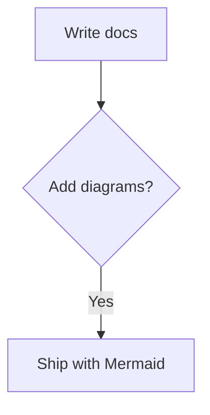

# mdpub

A Phoenix LiveView-based docs/publishing framework: serve Markdown files from a directory and render them into clean, interactive web pages with live updates.

## Features

- **Live content updates** — pages refresh automatically when markdown files change
- **LiveView navigation** — smooth page transitions without full reloads
- **YAML-driven navigation** — configure site structure via `content/nav.yml`
- Filesystem-backed content (`.md`)
- Nested routes and `index.md`
- ETS-backed content cache (keyed by file mtime)
- File watching with PubSub broadcasting
- Single binary release (via `mix release`)

## Mermaid diagrams

mdpub ships with Mermaid support. Add a fenced code block with the `mermaid` language:

````markdown

````

Mermaid is loaded from `priv/static/assets/mermaid.min.js` and initialized with `securityLevel: "strict"`.

## Run locally

```bash
cd mdpub
mix setup        # Installs dependencies + builds assets
mix phx.server   # Starts Phoenix server with live reload
```

Visit: <http://localhost:4000>

### Configuration

**Development & Test:**
- `SECRET_KEY_BASE` is auto-configured for dev/test environments
- No manual configuration needed

**Production:**
- `SECRET_KEY_BASE` — **Required** Phoenix secret (generate via `mix phx.gen.secret`)
- `PORT` (default: `4000`)
- `PHX_HOST` (default: `localhost`)
- `MDPUB_CONTENT_DIR` (default: `./content`)
- `MDPUB_WATCH` (default: `true` in dev, `false` in prod)

## Docker

```bash
docker build -t mdpub:dev .
docker run --rm -p 4000:4000 \
  -e PORT=4000 \
  -e SECRET_KEY_BASE=$(mix phx.gen.secret) \
  mdpub:dev
```

To mount custom content:

```bash
docker run --rm -p 4000:4000 \
  -e SECRET_KEY_BASE=$(mix phx.gen.secret) \
  -e MDPUB_CONTENT_DIR=/data \
  -v "$PWD/content":/data \
  mdpub:dev
```

> **Note:** In production deployments, generate a persistent `SECRET_KEY_BASE` and store it securely (e.g., in your secrets manager). Do not regenerate it on every container start.

## Contributing

See [CONTRIBUTING.md](CONTRIBUTING.md) for commit conventions and release steps.

## Migration from v0.1.x

If upgrading from the Plug-based v0.1.x:

1. **Breaking change:** mdpub now requires Phoenix 1.7 and LiveView
2. Run `mix setup` after pulling to install dependencies and build assets
3. In production, set `SECRET_KEY_BASE` environment variable (generate via `mix phx.gen.secret`)
4. Navigation is now configured via `content/nav.yml` (see example in repo)
5. Update deployment configs to use `mix phx.server` or releases with Phoenix

For detailed migration steps, see [docs/MIGRATION-v0.2.md](docs/MIGRATION-v0.2.md).
