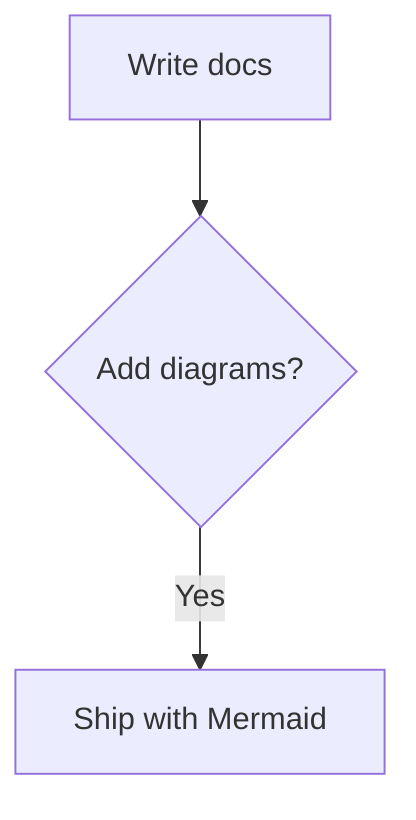

# mdpub

A simple Elixir-based docs/publishing framework: serve Markdown files from a directory and render them into clean web pages.

## Features

- Filesystem-backed content (`.md`)
- Nested routes and `index.md`
- Minimal ETS cache (keyed by file mtime)
- Optional file watching (invalidates cache on change)
- Single binary release (via `mix release`)

## Mermaid diagrams

mdpub ships with Mermaid support. Add a fenced code block with the `mermaid` language:

````markdown

````

Mermaid is loaded from `priv/static/assets/mermaid.min.js` and initialized with `securityLevel: "strict"`.

## Run locally

```bash
cd mdpub
mix deps.get
mix run --no-halt
```

Visit: <http://localhost:4000>

### Configuration

- `PORT` (default: `4000`)
- `MDPUB_CONTENT_DIR` (default: `./content`)
- `MDPUB_WATCH` (default: `true`)

## Docker

```bash
docker build -t mdpub:dev .
docker run --rm -p 4000:4000 -e PORT=4000 mdpub:dev
```

To mount content:

```bash
docker run --rm -p 4000:4000 \
  -e MDPUB_CONTENT_DIR=/data \
  -v "$PWD/content":/data \
  mdpub:dev
```

## Contributing

See [CONTRIBUTING.md](CONTRIBUTING.md) for commit conventions and release steps.

## Notes

This project intentionally stays minimal (Plug + Bandit + Earmark).
If you want Phoenix/LiveView features (nav sidebar, search, live reload, etc.), mdpub can evolve into a Phoenix umbrella later.
