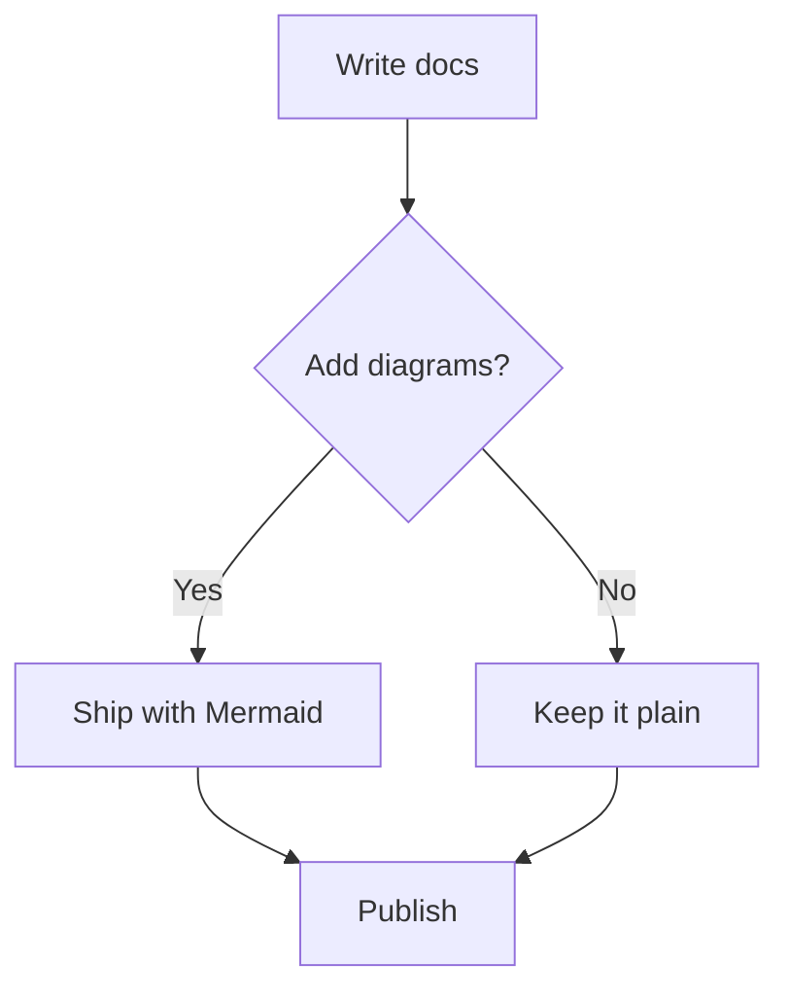
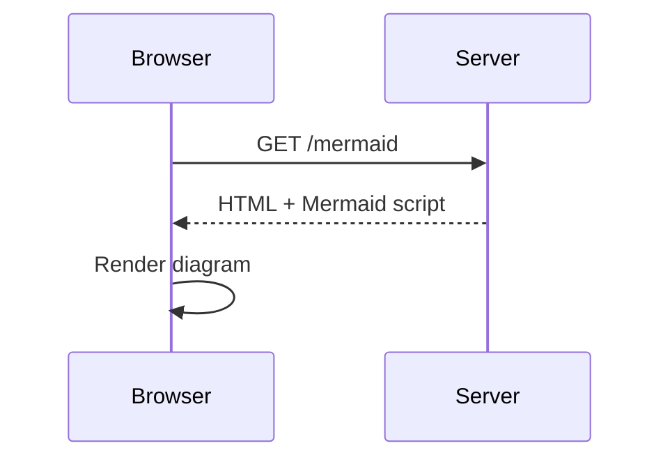

# Mermaid diagrams

mdpub can render Mermaid diagrams when you use a fenced code block labeled `mermaid`.

```mermaid
flowchart TD
  A[Write docs] --> B{Add diagrams?}
  B -- Yes --> C[Ship with Mermaid]
  B -- No --> D[Keep it plain]
  C --> E[Publish]
  D --> E
```

You can also use sequence diagrams:

```mermaid
sequenceDiagram
  participant Browser
  participant Server
  Browser->>Server: GET /mermaid
  Server-->>Browser: HTML + Mermaid script
  Browser->>Browser: Render diagram
```
